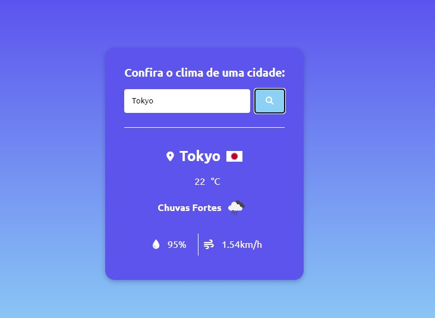
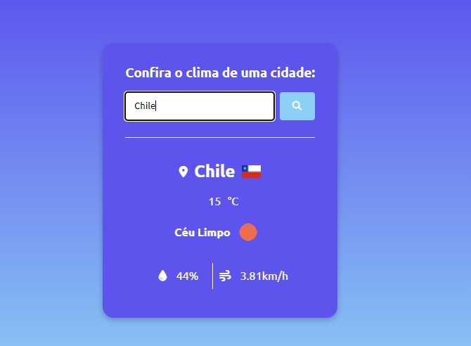
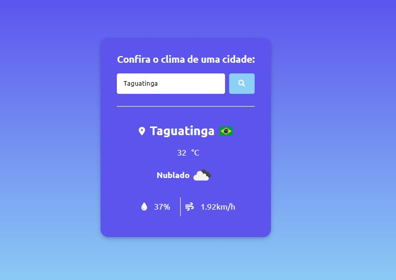

# clima-api
 

<b><i><u>'Clima'.</b></i></u> Projeto aplicação de clima que utiliza uma API para trazer dados climáticos de cidades.  

Projeto construído seguindo as dicas do <b>Hora de Codar </b> [YouTube](https://youtu.be/VS8EBgPwsSU?t=3147)

## :globe_with_meridians: Tecnologias

  

 

 

## 📱 Contato

